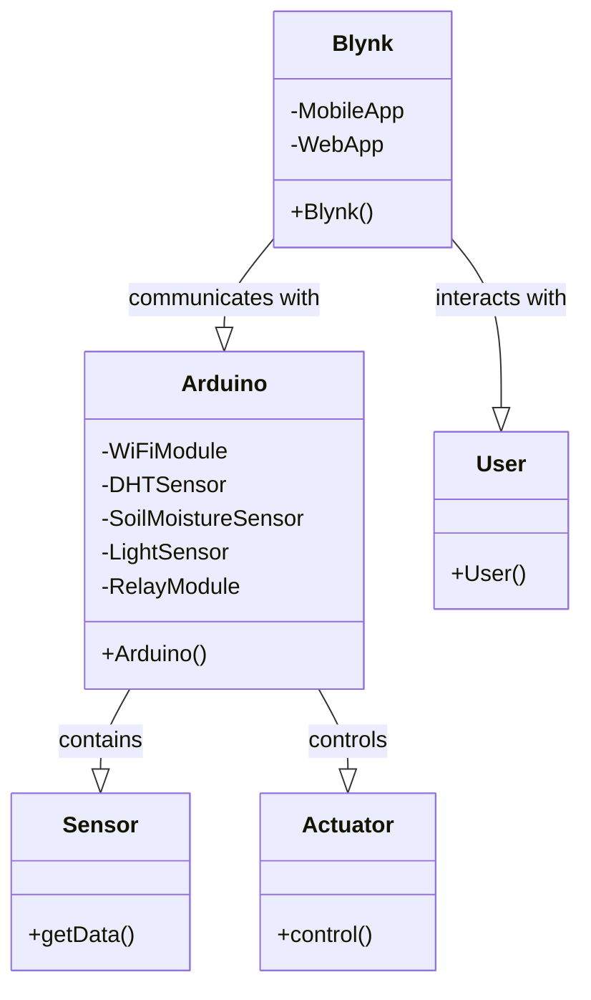

# SmartFarmTest

### 클래스 다이어그램 

```mermaid
classDiagram
    class Arduino {
        +Arduino()
        -WiFiModule
        -DHTSensor
        -SoilMoistureSensor
        -LightSensor
        -RelayModule
    }

    class Blynk {
        +Blynk()
        -MobileApp
        -WebApp
    }

    class User {
        +User()
    }

    Arduino --|> Sensor : contains
    Arduino --|> Actuator : controls
    Blynk --|> User : interacts with
    Blynk --|> Arduino : communicates with

    class Sensor {
        +getData()
    }

    class Actuator {
        +control()
    }
```
